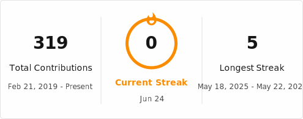

# Joseph | SplatDev

Welcome to my GitHub profile! I'm a software development apprentice in the UK, building projects primarily with TypeScript and Java.

---

## What I'm Doing

|  | Area | Focus |
| --- | --- | --- |
|  | **Frontend** | Building web apps with **AngularJS** and **TypeScript**. |
|  | **Backend** | Learning **Java** and **Spring Boot**. |
|  | **Side projects** | Building iOS apps, and working with cloud platforms. |

## What I'm Using

### Languages

### Frontend and Frameworks

### Tools and Platforms

## GitHub Activity

